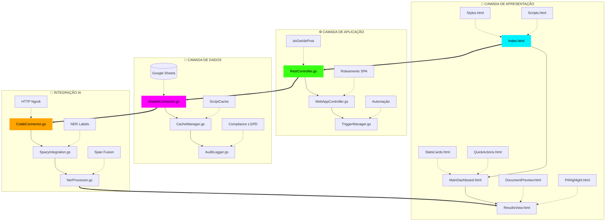
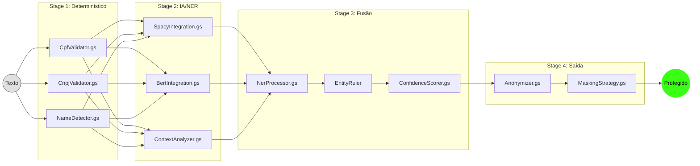

# Guardião SEDF
## MVP de Proteção Inteligente de Dados Pessoais

> **Versão 3.0** | 31 de Janeiro de 2026

---

# Parte I — Visão Executiva

## 1. Introdução

O **Guardião SEDF** é um sistema de proteção de dados pessoais desenvolvido para a *Secretaria de Estado de Educação do Distrito Federal* (SEDF), resolvendo o conflito entre a **Lei de Acesso à Informação** (LAI) e a **Lei Geral de Proteção de Dados** (LGPD) através de Inteligência Artificial híbrida.

## 2. Métricas do Projeto

| Categoria                          | Quantidade | Descrição                          |
|------------------------------------|:----------:|------------------------------------|
| Google Apps Script (`.gs`)         | **213**    | Módulos de backend                 |
| Templates HTML (`.html`)           | **65**     | Componentes de frontend            |
| Adaptador Python                   | **1**      | `adaptador_semantico.py`           |
| Documentação                       | **3**      | MVP, PROPOSTA, etc.                |
| **TOTAL**                          | **282**    | Arquivos de código/documentação    |

---

# Parte II — Arquitetura Técnica

## 3. Diagrama de Arquitetura Serverless Híbrida



### Fluxo de Dados

```mermaid
flowchart LR
    INPUT["📄 Documento"] --> REGEX["🔍 Regex/Validação"]
    REGEX --> NER["🤖 NER/IA Colab"]
    NER --> FUSION["🔗 SpanMerger"]
    FUSION --> ANON["🔒 Anonymizer"]
    ANON --> OUTPUT["✅ Saída Protegida"]

    style INPUT fill:#e0e0e0,stroke:#333,color:#000
    style REGEX fill:#00f2ff,stroke:#00f2ff,color:#000
    style NER fill:#ff00ff,stroke:#ff00ff,color:#000
    style FUSION fill:#ffa500,stroke:#ffa500,color:#000
    style ANON fill:#39ff14,stroke:#39ff14,color:#000
    style OUTPUT fill:#e0e0e0,stroke:#333,color:#000
```



---

# Parte III — Inventário Completo de Módulos

## 4. Módulos Google Apps Script (`.gs`) — 213 Arquivos

### 4.1 Núcleo do Sistema (5 arquivos)

| Arquivo               | Função                                    |
|-----------------------|-------------------------------------------|
| `Main.gs`             | Ponto de entrada, `onOpen()`, menu        |
| `Installer.gs`        | Setup automático do ambiente              |
| `Config.gs`           | Singleton de configurações globais        |
| `Configuracao.gs`     | Gerenciamento de parâmetros dinâmicos     |
| `Constants.gs`        | Enums: `PII_TYPES`, `SENSITIVITY_LEVELS`  |
| `TriggerManager.gs`   | Automação via triggers temporais          |

### 4.2 Controladores e API (7 arquivos)

| Arquivo               | Função                                    |
|-----------------------|-------------------------------------------|
| `RestController.gs`   | API Gateway (`doGet`/`doPost`)            |
| `WebAppController.gs` | Controlador da interface HTML principal   |
| `RouteHandler.gs`     | Roteador SPA (Single Page Application)    |
| `RequestParser.gs`    | Parse de requisições HTTP                 |
| `ResponseBuilder.gs`  | Construção de respostas JSON/HTML         |
| `CorsHandler.gs`      | Tratamento de CORS                        |
| `Middleware.gs`       | Pipeline de processamento                 |

### 4.3 Detecção de PII — Dados Pessoais (28 arquivos)

| Arquivo                   | Função                                |
|---------------------------|---------------------------------------|
| `PiiDetector.gs`          | Motor principal de orquestração       |
| `CpfValidator.gs`         | Validação algorítmica (Módulo 11)     |
| `CpfRegex.gs`             | Padrões regex para CPF                |
| `CnpjValidator.gs`        | Validação algorítmica de CNPJs        |
| `CnpjRegex.gs`            | Padrões regex para CNPJ               |
| `CnhRegex.gs`             | Padrões regex para CNH                |
| `RgDetector.gs`           | Detecção de RG                        |
| `RgRegex.gs`              | Padrões regex para RG                 |
| `EmailDetector.gs`        | Detecção de e-mails (RFC 5322)        |
| `EmailRegex.gs`           | Padrões regex para e-mail             |
| `PhoneDetector.gs`        | Detecção de telefones                 |
| `PhoneRegex.gs`           | Padrões regex para telefone           |
| `MatriculaDetector.gs`    | Detecção de matrículas SEDF           |
| `MatriculaRegex.gs`       | Padrões regex para matrículas         |
| `AddressDetector.gs`      | Detecção de endereços (foco Brasília) |
| `AddressRegex.gs`         | Padrões regex para endereços          |
| `CepRegex.gs`             | Padrões regex para CEP                |
| `DateDetector.gs`         | Detecção de datas de nascimento       |
| `DateRegex.gs`            | Padrões regex para datas              |
| `NameDetector.gs`         | Detecção heurística de nomes          |
| `CartaoCredito.gs`        | Detecção de cartão (algoritmo Luhn)   |
| `ContaBancariaRegex.gs`   | Padrões regex para contas bancárias   |
| `PassaporteRegex.gs`      | Padrões regex para passaporte         |
| `TituloEleitorRegex.gs`   | Padrões regex para título de eleitor  |
| `PisRegex.gs`             | Padrões regex para PIS/PASEP          |
| `PlacaVeiculoRegex.gs`    | Padrões regex para placas             |
| `ProcessoJudicialRegex.gs`| Padrões regex para processos          |
| `BrazilianFormatValidator.gs` | Validação consolidada BR         |

### 4.4 Dados Sensíveis — Art. 5º, II LGPD (7 arquivos)

| Arquivo                       | Função                            |
|-------------------------------|-----------------------------------|
| `SensitiveDataClassifier.gs`  | Classificador central             |
| `BiometricDataDetector.gs`    | Detecção de dados biométricos     |
| `MedicalDataDetector.gs`      | Detecção de dados médicos/saúde   |
| `RacialDataDetector.gs`       | Detecção de dados raciais/étnicos |
| `ReligiousDataDetector.gs`    | Detecção de dados religiosos      |
| `PoliticalDataDetector.gs`    | Detecção de dados políticos       |
| `SexualOrientationDetector.gs`| Detecção de orientação sexual     |

### 4.5 Processamento de Linguagem Natural — NLP (14 arquivos)

| Arquivo               | Função                                    |
|-----------------------|-------------------------------------------|
| `NerProcessor.gs`     | Orquestrador NER (Fusão Regex + IA)       |
| `SpacyIntegration.gs` | Adaptador semântico para spaCy            |
| `BertIntegration.gs`  | Integração com BERTimbau                  |
| `EntidadeNomeada.gs`  | Classe de entidade nomeada                |
| `LanguageDetector.gs` | Detecção de idioma                        |
| `ContextAnalyzer.gs`  | Análise de contexto semântico             |
| `ContextPreserver.gs` | Preservação de contexto                   |
| `AmbiguityResolver.gs`| Resolução de ambiguidades                 |
| `SentimentAnalyzer.gs`| Análise de sentimento                     |
| `TopicClassifier.gs`  | Classificação de tópicos                  |
| `LocationDetector.gs` | Detecção de locais (LOC)                  |
| `OrganizationDetector.gs` | Detecção de organizações (ORG)        |
| `EntityRulerManager.gs`| Gerenciamento de regras NER              |
| `SpanMerger.gs`       | Merge de spans de entidades               |

### 4.6 Anonimização e Mascaramento (13 arquivos)

| Arquivo                   | Função                                |
|---------------------------|---------------------------------------|
| `Anonymizer.gs`           | Motor principal de anonimização       |
| `ClassificacaoAnonymizer.gs` | Anonimização por classificação     |
| `FolhaPagamentoAnonymizer.gs` | Anonimização de folhas            |
| `MaskingStrategy.gs`      | Estratégias de mascaramento           |
| `PseudonymGenerator.gs`   | Gerador de pseudônimos consistentes   |
| `ReversibleAnonymizer.gs` | Anonimização reversível               |
| `TokenReplacer.gs`        | Substituição por tokens               |
| `HashGenerator.gs`        | Geração de hashes SHA-256             |
| `HashMapper.gs`           | Mapeamento de hashes                  |
| `DigestGenerator.gs`      | Geração de digests                    |
| `DataMinimizer.gs`        | Minimização de dados                  |
| `RedactionReviewer.gs`    | Revisão de redações                   |
| `DenuncianteProtector.gs` | Proteção de denunciantes              |

### 4.7 Compliance e LGPD (14 arquivos)

| Arquivo                       | Função                            |
|-------------------------------|-----------------------------------|
| `LgpdComplianceChecker.gs`    | Verificador de conformidade       |
| `ComplianceReporter.gs`       | Relatórios de compliance          |
| `ConsentManager.gs`           | Gerenciamento de consentimento    |
| `DataSubjectRightsManager.gs` | Direitos do titular               |
| `RightToAccessHandler.gs`     | Direito de acesso                 |
| `RightToErasureHandler.gs`    | Direito ao esquecimento           |
| `RightToPortabilityHandler.gs`| Direito à portabilidade           |
| `RightToRectificationHandler.gs` | Direito à retificação          |
| `DataProtectionOfficer.gs`    | Funções do DPO                    |
| `PurposeValidator.gs`         | Validação de finalidade           |
| `ImpactAssessment.gs`         | Avaliação de impacto (RIPD)       |
| `DataRetentionManager.gs`     | Retenção de dados                 |
| `PublicDataClassifier.gs`     | Classificação de dados públicos   |
| `TransparencyManager.gs`      | Gestão de transparência           |

### 4.8 Processamento de Documentos (14 arquivos)

| Arquivo               | Função                                    |
|-----------------------|-------------------------------------------|
| `DocumentProcessor.gs`| Orquestrador principal                    |
| `DocumentValidator.gs`| Validação de documentos                   |
| `Documento.gs`        | Classe de documento                       |
| `PdfParser.gs`        | Parser de PDF                             |
| `DocxParser.gs`       | Parser de DOCX                            |
| `SpreadsheetParser.gs`| Parser de planilhas                       |
| `TextExtractor.gs`    | Extração de texto (Google Docs)           |
| `TableExtractor.gs`   | Extração de tabelas                       |
| `ImageExtractor.gs`   | Extração de imagens                       |
| `OcrProcessor.gs`     | OCR via Drive API                         |
| `MetadataCleaner.gs`  | Limpeza de metadados                      |
| `FormatConverter.gs`  | Conversão de formatos                     |
| `SignatureDetector.gs`| Detecção de assinaturas                   |
| `HiddenColumnDetector.gs` | Detecção de colunas ocultas           |

### 4.9 Handlers de Domínio SEDF (20 arquivos)

| Arquivo                   | Função                                |
|---------------------------|---------------------------------------|
| `AlunoDataHandler.gs`     | Proteção de dados de alunos (Art. 14) |
| `ProfessorDataHandler.gs` | Dados de professores                  |
| `ServidorDataHandler.gs`  | Dados de servidores                   |
| `EscolaDataHandler.gs`    | Dados de escolas                      |
| `MatriculaEscolarHandler.gs` | Matrículas escolares               |
| `ProcessoSeletivoHandler.gs` | Processos seletivos                |
| `ConcursoPublicoHandler.gs` | Concursos públicos                  |
| `ContratoTemporarioHandler.gs` | Contratos temporários            |
| `SubstitutoHandler.gs`    | Professores substitutos               |
| `TerceirizadoHandler.gs`  | Terceirizados                         |
| `RhDataHandler.gs`        | Dados de RH                           |
| `ProcessoDisciplinarHandler.gs` | PADs e Sindicâncias (Sigilo)    |
| `HistoricoMedicoHandler.gs` | Históricos médicos                  |
| `RegionalEnsinoHandler.gs`| Regionais de ensino                   |
| `EditalProcessor.gs`      | Processamento de editais              |
| `ProcessoSeletivo.gs`     | Classe de processo seletivo           |
| `Denuncia.gs`             | Classe de denúncia                    |
| `PedidoInformacaoHandler.gs` | Pedidos e-SIC                      |
| `RecursoHandler.gs`       | Recursos administrativos              |
| `Installer.gs`            | Setup automático                      |

### 4.10 Integração com Colab/IA (8 arquivos)

| Arquivo               | Função                                    |
|-----------------------|-------------------------------------------|
| `ColabConnector.gs`   | Bridge HTTP para API Python (Ngrok)       |
| `NgrokUrlUpdater.gs`  | Atualização dinâmica de URL               |
| `ModelManager.gs`     | Gerenciamento de modelos                  |
| `ModelTrainer.gs`     | Treinamento de modelos                    |
| `ConfidenceScorer.gs` | Pontuação de confiança                    |
| `FalsePositiveHandler.gs` | Tratamento de falsos positivos        |
| `FalseNegativeHandler.gs` | Tratamento de falsos negativos        |
| `FeedbackCollector.gs`| Coleta de feedback para re-treino         |

### 4.11 Integrações Externas GDF (9 arquivos)

| Arquivo               | Função                                    |
|-----------------------|-------------------------------------------|
| `DodfScraper.gs`      | Scraper do Diário Oficial do DF           |
| `DodfValidator.gs`    | Validação de publicações DODF             |
| `DodfPublisher.gs`    | Publicação no DODF                        |
| `EsicIntegration.gs`  | Integração com e-SIC                      |
| `OuvidoriaIntegration.gs` | Integração com Ouvidoria              |
| `SinproIntegration.gs`| Integração com SINPRO-DF                  |
| `TcdfReporter.gs`     | Relatórios para TCDF                      |
| `MpdftReporter.gs`    | Relatórios para MPDFT                     |
| `PublicationValidator.gs` | Validação de publicações              |

### 4.12 Backend e Persistência (14 arquivos)

| Arquivo               | Função                                    |
|-----------------------|-------------------------------------------|
| `SheetsConnector.gs`  | DAO centralizado (Google Sheets)          |
| `CacheManager.gs`     | Cache em memória (ScriptCache)            |
| `IndexManager.gs`     | Gerenciamento de índices                  |
| `QueryBuilder.gs`     | Construção de consultas                   |
| `QueueManager.gs`     | Gerenciamento de filas                    |
| `BatchProcessor.gs`   | Processamento em lote                     |
| `BatchUpdater.gs`     | Atualização em lote                       |
| `TransactionManager.gs`| Transações (LockService)                 |
| `BackupManager.gs`    | Backup de dados                           |
| `RecoveryManager.gs`  | Recuperação de dados                      |
| `MigrationManager.gs` | Migração de dados                         |
| `DataArchiver.gs`     | Arquivamento de dados                     |
| `DataPurger.gs`       | Expurgo de dados                          |
| `VersionController.gs`| Controle de versão                        |

### 4.13 Auditoria e Logging (10 arquivos)

| Arquivo               | Função                                    |
|-----------------------|-------------------------------------------|
| `AuditLogger.gs`      | Logger LGPD com hash de integridade       |
| `ImmutableLogWriter.gs`| Logs imutáveis (append-only)             |
| `LogAuditoria.gs`     | Registro de auditoria                     |
| `ActivityTracker.gs`  | Rastreamento de atividades                |
| `Logger.gs`           | Logger geral                              |
| `ProgressTracker.gs`  | Rastreamento de progresso                 |
| `IncidentReporter.gs` | Relatórios de incidentes                  |
| `RiskAssessment.gs`   | Avaliação de riscos                       |
| `RiskLevelClassifier.gs`| Classificação de nível de risco         |
| `DataFlowMapper.gs`   | Mapeamento de fluxo de dados              |

### 4.14 Autenticação e Autorização (9 arquivos)

| Arquivo               | Função                                    |
|-----------------------|-------------------------------------------|
| `AuthManager.gs`      | RBAC (Role-Based Access Control)          |
| `SessionManager.gs`   | Gerenciamento de sessões                  |
| `PermissionManager.gs`| Gerenciamento de permissões               |
| `PermissionChecker.gs`| Verificação de permissões                 |
| `UserValidator.gs`    | Validação de usuários                     |
| `Usuario.gs`          | Classe de usuário                         |
| `TokenGenerator.gs`   | Geração de tokens                         |
| `ApiKeyManager.gs`    | Gerenciamento de API keys                 |
| `ShareManager.gs`     | Gerenciamento de compartilhamento         |

### 4.15 Validação e Formatação (5 arquivos)

| Arquivo                   | Função                                |
|---------------------------|---------------------------------------|
| `DataValidator.gs`        | Validação de dados                    |
| `BrazilianFormatValidator.gs` | Validação de formatos BR          |
| `PatternMatcher.gs`       | Matching de padrões                   |
| `RegexLibrary.gs`         | Biblioteca de regex                   |
| `CustomPatternBuilder.gs` | Construtor de padrões customizados    |

### 4.16 Monitoramento e Status (9 arquivos)

| Arquivo               | Função                                    |
|-----------------------|-------------------------------------------|
| `HealthChecker.gs`    | Verificação de saúde do sistema           |
| `PerformanceMonitor.gs`| Monitoramento de performance             |
| `PrazoMonitor.gs`     | Monitoramento de prazos (LAI)             |
| `DriveMonitor.gs`     | Monitoramento do Drive                    |
| `FileWatcher.gs`      | Observador de arquivos                    |
| `QuotaManager.gs`     | Gerenciamento de cotas                    |
| `RateLimiter.gs`      | Limitador de taxa                         |
| `CircuitBreaker.gs`   | Disjuntor de circuito                     |
| `RetryHandler.gs`     | Tratamento de retentativas                |

### 4.17 Notificações e Alertas (6 arquivos)

| Arquivo               | Função                                    |
|-----------------------|-------------------------------------------|
| `NotificationManager.gs`| Gerenciamento de notificações           |
| `NotificationSender.gs`| Envio de notificações                    |
| `AlertManager.gs`     | Gerenciamento de alertas                  |
| `AlertSender.gs`      | Envio de alertas                          |
| `EmailSender.gs`      | Envio de e-mails                          |
| `ReportSender.gs`     | Envio de relatórios                       |

### 4.18 UI/UX Backend (22 arquivos)

| Arquivo                 | Função                                  |
|-------------------------|-----------------------------------------|
| `HtmlTemplateRenderer.gs`| Renderização de templates HTML         |
| `TemplateManager.gs`    | Gerenciamento de templates              |
| `DashboardBuilder.gs`   | Construtor de dashboards                |
| `FormHandler.gs`        | Tratamento de formulários               |
| `SearchEngine.gs`       | Motor de busca                          |
| `ColorCoder.gs`         | Codificação semântica por cores         |
| `ColorPaletteManager.gs`| Gerenciamento de paleta Neon            |
| `NeonThemeManager.gs`   | Gerenciamento do tema Neon Dark         |
| `ContrastChecker.gs`    | Verificação de contraste WCAG           |
| `AccessibilityManager.gs`| Gerenciamento de acessibilidade        |
| `ModalManager.gs`       | Gerenciamento de modais                 |
| `TooltipManager.gs`     | Gerenciamento de tooltips               |
| `LoadingIndicator.gs`   | Indicadores de carregamento             |
| `ErrorDisplay.gs`       | Exibição de erros                       |
| `ErrorHandler.gs`       | Tratamento de erros                     |
| `SuccessDisplay.gs`     | Exibição de sucesso                     |
| `PriorityScorer.gs`     | Pontuação de prioridade                 |
| `AutoProcessor.gs`      | Processamento automático                |
| `FileUploader.gs`       | Upload de arquivos                      |
| `FolderOrganizer.gs`    | Organização de pastas                   |
| `TimestampGenerator.gs` | Geração de timestamps                   |
| `AuditReportExporter.gs`| Exportação de relatórios                |

---

## 5. Templates HTML (`.html`) — 65 Arquivos

### 5.1 Páginas Principais (9 arquivos)

| Arquivo               | Função                                    |
|-----------------------|-------------------------------------------|
| `Index.html`          | App Shell (estrutura SPA)                 |
| `LoginPage.html`      | Autenticação Google                       |
| `MainDashboard.html`  | Dashboard principal com KPIs              |
| `WelcomeScreen.html`  | Tela de boas-vindas                       |
| `ProcessPage.html`    | Página de processamento                   |
| `ReportsPage.html`    | Página de relatórios                      |
| `SettingsPage.html`   | Página de configurações                   |
| `AuditPage.html`      | Página de auditoria                       |
| `ErrorPage.html`      | Página de erro                            |

### 5.2 Layout e Estrutura (7 arquivos)

| Arquivo         | Função                              |
|-----------------|-------------------------------------|
| `Header.html`   | Cabeçalho da aplicação              |
| `Footer.html`   | Rodapé da aplicação                 |
| `Sidebar.html`  | Barra lateral                       |
| `Navigation.html`| Navegação principal                |
| `Breadcrumb.html`| Trilha de navegação                |
| `Styles.html`   | CSS Neon Dark Mode                  |
| `Scripts.html`  | JavaScript principal                |

### 5.3 Componentes de Dashboard (7 arquivos)

| Arquivo                 | Função                              |
|-------------------------|-------------------------------------|
| `StatsCards.html`       | Cards de estatísticas               |
| `RecentActivity.html`   | Atividade recente                   |
| `QuickActions.html`     | Ações rápidas                       |
| `ChartContainer.html`   | Container de gráficos               |
| `ReportDashboard.html`  | Dashboard de relatórios             |
| `PerformanceMetrics.html`| Métricas de performance            |
| `SystemStatus.html`     | Status do sistema                   |

### 5.4 Visualização de Dados (10 arquivos)

| Arquivo               | Função                                    |
|-----------------------|-------------------------------------------|
| `ResultsView.html`    | Human-in-the-Loop (validação)             |
| `DocumentList.html`   | Lista de documentos                       |
| `DocumentCard.html`   | Card de documento                         |
| `DocumentPreview.html`| Preview de documento                      |
| `EntityList.html`     | Lista de entidades detectadas             |
| `PiiHighlight.html`   | Destaque colorido de PIIs                 |
| `ComparisonView.html` | Comparação antes/depois                   |
| `Timeline.html`       | Linha do tempo                            |
| `AuditLog.html`       | Log de auditoria                          |
| `ComplianceReport.html`| Relatório de compliance                  |

### 5.5 Modais e Diálogos (6 arquivos)

| Arquivo             | Função                     |
|---------------------|----------------------------|
| `UploadModal.html`  | Modal de upload            |
| `ProcessingModal.html`| Modal de processamento   |
| `ConfirmDialog.html`| Diálogo de confirmação     |
| `ErrorModal.html`   | Modal de erro              |
| `SuccessModal.html` | Modal de sucesso           |
| `ShareModal.html`   | Modal de compartilhamento  |

### 5.6 Formulários e Filtros (9 arquivos)

| Arquivo           | Função                          |
|-------------------|---------------------------------|
| `FilterPanel.html`| Painel de filtros               |
| `SearchBar.html`  | Barra de busca                  |
| `ConfigPanel.html`| Painel de configurações         |
| `UserConfig.html` | Configurações do usuário        |
| `PiiConfig.html`  | Configuração de PII             |
| `AiConfig.html`   | Configuração de IA              |
| `AuditFilters.html`| Filtros de auditoria           |
| `FeedbackForm.html`| Formulário de feedback         |
| `ExportOptions.html`| Opções de exportação          |

### 5.7 Componentes de UI (10 arquivos)

| Arquivo                 | Função                        |
|-------------------------|-------------------------------|
| `LoadingSpinner.html`   | Spinner de carregamento       |
| `ProgressBar.html`      | Barra de progresso            |
| `Pagination.html`       | Paginação                     |
| `ContextMenu.html`      | Menu de contexto              |
| `DownloadButton.html`   | Botão de download             |
| `EmptyState.html`       | Estado vazio                  |
| `NotificationToast.html`| Toast de notificação          |
| `NotificationCenter.html`| Central de notificações      |
| `ThemeToggle.html`      | Toggle de tema                |
| `VersionInfo.html`      | Informações de versão         |

### 5.8 Usuário e Suporte (7 arquivos)

| Arquivo                 | Função                        |
|-------------------------|-------------------------------|
| `UserProfile.html`      | Perfil do usuário             |
| `UserWidget.html`       | Widget de usuário             |
| `LanguageSelector.html` | Seletor de idioma             |
| `HelpPanel.html`        | Painel de ajuda               |
| `KeyboardShortcuts.html`| Atalhos de teclado            |
| `BatchProcessing.html`  | Processamento em lote         |
| `BatchProgressView.html`| Progresso de lote             |

---

# Parte IV — Pipeline de Detecção

## 6. Fluxo de Processamento Híbrido



### Precisão do Pipeline

| Método        | Precisão | Característica                           |
|---------------|:--------:|------------------------------------------|
| Regex         | ~99%     | Determinístico, alta confiança           |
| NER/IA        | ~85-95%  | Contextual, resolve ambiguidades         |
| **Híbrido**   | **~98%** | Melhor dos dois mundos                   |

> **Regra de Prioridade**: `Regex before="ner"` — determinístico tem precedência sobre probabilístico.

---

# Parte V — Interface Neon Dark Mode

## 7. Design System

### 7.1 Paleta de Cores (`Styles.html`)

```css
:root {
  /* Fundos */
  --bg-dark: #080808;
  --bg-card: #121212;
  
  /* Cores Neon */
  --neon-cyan: #00f2ff;
  --neon-magenta: #ff00ff;
  --neon-green: #39ff14;
  --neon-red: #ff073a;
  
  /* Texto */
  --text-primary: #e0e0e0;
  --text-secondary: #a0a0a0;
  
  /* Glassmorphism */
  --glass-border: rgba(255, 255, 255, 0.1);
}
```

### 7.2 Codificação Semântica

| Cor                          | Código      | Significado                           |
|------------------------------|:-----------:|---------------------------------------|
| 🟣 **Magenta**               | `#FF00FF`   | Risco Crítico / Dado Sensível (Art. 5º, II) |
| 🔵 **Ciano**                 | `#00FFFF`   | Dado Pessoal Identificável (CPF, Nome)     |
| 🟢 **Verde Neon**            | `#39FF14`   | Sistema OK / Texto Seguro                   |

### 7.3 Conformidade WCAG 2.1

| Combinação                         | Rácio    | Nível  |
|------------------------------------|:--------:|:------:|
| Verde Neon (`#39FF14`) / `#121212` | **>10:1**| AAA ✅ |

---

# Parte VI — Princípios Arquiteturais

## 8. Decisões de Design

| Princípio                  | Implementação                                   |
|----------------------------|-------------------------------------------------|
| **Zero-Cost Architecture** | 100% infraestrutura gratuita (Google Workspace) |
| **Privacy by Design**      | Privacidade como padrão (Art. 46 LGPD)          |
| **Human-in-the-Loop**      | Validação humana obrigatória (`ResultsView.html`) |
| **Dívida Técnica Documentada** | Trade-off Sheets vs RDBMS                   |
| **Modularidade**           | 213 módulos com responsabilidades únicas        |
| **SPA Architecture**       | Navegação fluida sem recarregamento             |

---

# Parte VII — Referências Legais

## Marco Regulatório

- [Lei nº 12.527/2011](http://www.planalto.gov.br/ccivil_03/_ato2011-2014/2011/lei/l12527.htm) — Lei de Acesso à Informação (LAI)
- [Lei nº 13.709/2018](http://www.planalto.gov.br/ccivil_03/_ato2015-2018/2018/lei/l13709.htm) — Lei Geral de Proteção de Dados (LGPD)
- [Decreto nº 10.046/2019](http://www.planalto.gov.br/ccivil_03/_ato2019-2022/2019/decreto/D10046.htm) — Governança de dados públicos

## Órgãos de Controle

- **TCDF** — Operação Educação
- **MPDFT** — Recomendações de Transparência

## Tecnologias

- [spaCy](https://spacy.io/) — Industrial-strength NLP
- [BERTimbau](https://github.com/neuralmind-ai/portuguese-bert) — BERT para Português Brasileiro
- [Google Apps Script](https://developers.google.com/apps-script) — Documentação Oficial

## Acessibilidade

- [WCAG 2.1](https://www.w3.org/WAI/WCAG21/quickref/) — Web Content Accessibility Guidelines

---

<div align="center">

**Guardião SEDF** — *Proteção Inteligente de Dados Pessoais*

Versão 3.0 | Janeiro 2026

</div>
